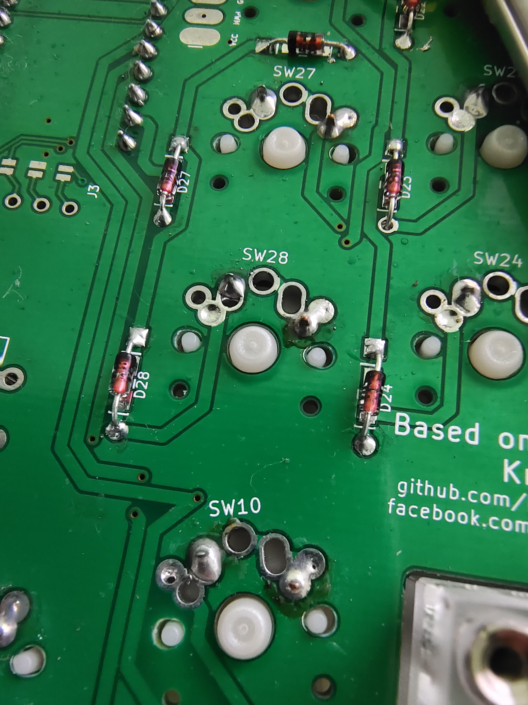
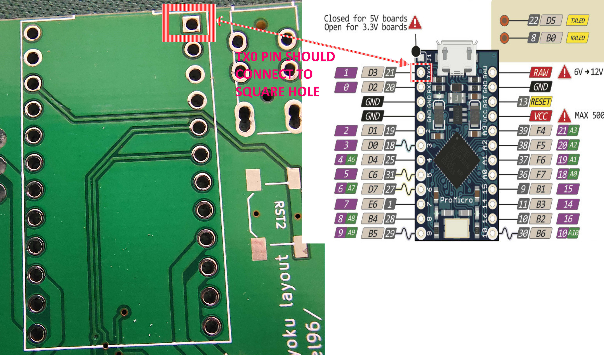

## Build Instruction

This is not a complete guide, its WIP. I am giving important pointers for it right now.

* Diode direction, diodes are polarised, and will connect only one way for proper fuctioning. Both SMD and THT have line on them to signify the Cathod side of the diode. The leg/side with line will go towards the Square hole side of diode pads. This is illustrated in the photo below.

* ProMicro Allightment in done based on TX0 pin, the TX0 pin should go into the square hole on the promicro holes.
